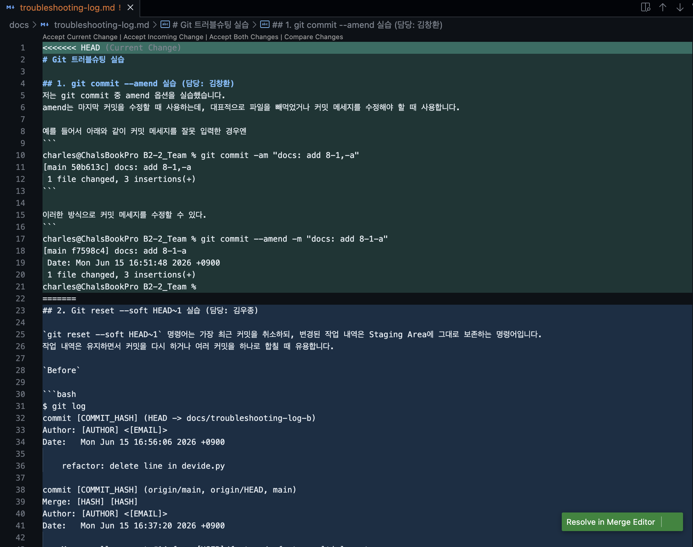
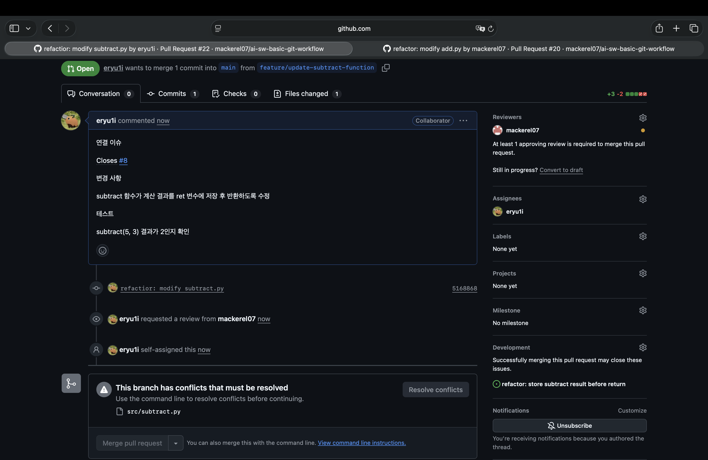

# Merge 충돌 해결

## Merge 충돌 해결 1 (자명 충돌)

troubleshooting-log.md 파일에 동시에 내용을 추가하여 생긴 merge 충돌을 해결.

## Merge 충돌 해결 2 (비자명 충돌)

### 상황
- main 브랜치: src/ 아래 파일들을 src/calculator/ 폴더로 이동(reorganize)
- 내 브랜치(feature/update-subtract-function): 같은 subtract.py의 내용을 수정
- main을 내 브랜치로 머지할 때, "파일 이동 vs 내용 수정"이 겹쳐 충돌 발생

### 충돌 내용
- 같은 줄을 다르게 고친 일반 충돌이 아니라, 한쪽은 파일을 이동하고
  다른 쪽은 그 파일 내용을 수정해 발생한 비자명 충돌
- GitHub 웹에서 자동 병합 불가 메시지 확인 (캡처 첨부)
- 로컬에서 git status로 충돌 상태 확인 후 직접 해결

### 해결 과정
- main을 로컬 브랜치로 머지 (git merge main)
- 파일의 최종 위치는 이동된 경로(src/calculator/subtract.py)를 채택하고,
  내가 수정한 내용을 해당 파일에 반영
- 해결 후 커밋(aa6d806)하고 push → 웹에서 병합 가능 상태로 전환

### 결과
- 최종 파일: src/calculator/subtract.py (이동된 위치 + 내 수정 내용 유지)
- 머지 커밋: aa6d806
- 관련 PR/커밋: (PR 링크)

### 배운 점(Learnings)
- 충돌 마커(<<<<<<<)는 "같은 줄을 다르게 수정"한 경우에 뜨고,
  "파일 이동/삭제 vs 내용 수정"처럼 구조가 충돌하는 경우엔 마커 대신
  git status의 상태 메시지로 충돌이 표시된다는 것을 알게 됨
- 충돌은 GitHub 웹이 아니라 로컬에서 해결한 뒤 push해야 한다는 흐름을 이해함

